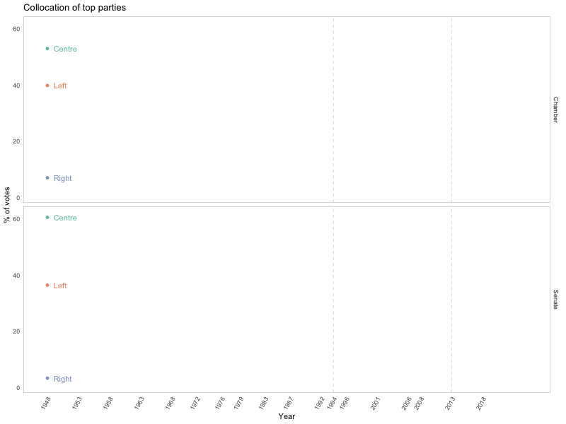

```{r}
library(tidyverse)
library(ggplot2)
library(ggridges)
library(dplyr)
library(rnaturalearth)
library(rgeos)
library(leaflet)
library(shiny)
library(sf)
library(viridis) 
library(shinydashboard)
library(ggrepel)
library(gganimate)
library(gifski)
library(plotly)
library(tidyr)
library(knitr)

`%notin%` <- Negate(`%in%`)

election_years <- c(1948, 1953, 1958, 1963, 1968, 1972, 1976, 1979, 1983, 1987, 1992, 1994, 1996, 2001, 2006, 2008, 2013, 2018)
```

## Notes on translations

For the purpose of this analysis, it has been decided to provide a translation for all Italian terms that we will encounter.
Since many of this terms have a non-univocal translation in English, it has been decided to provide a translation table that goes as follows:

ITALIAN TERM                TRANSLATION
Scrutinio                   Ballot
Lista (elettorale)          (Electoral) list
Elettore                    Constituent
Votante                     Voter
Camera (dei Deputati)       Chamber (of Deputies)   
Senato (della Repubblica)   Senate (of the Republic)
Trasversalismo              Syncretic (politics)

In the following sections, during the length of the whole project, only the English terms will be used. 
The necessary steps will be taken in order to translate the Italian terms present in the used datasets to their English counterpart.

## Additional notes

In the context of the used datasets, the ballot contains information, for each election year and for both houses (Chamber and Senate), regarding the number of people that CAN vote (constituents) and the number of people that HAVE voted (voters).

The (electoral) list provides the number of votes received by each party during a given election year.

Italy introduced the universal suffrage in 1945 by extending the right to vote to women. 
Since the earliest election year in our dataset is 1948, all votes come from both male and female population.

All Italian citizen above the age of 18 can vote for the Chamber of Deputies.
Only those who have reached the age of 25 are able to vote for the election of the Senate.

## Importing and cleaning political data

In order to reduce the number of .csv files associated with the project, some operation have been performed on the data sets outside of RStudio. 
The .csv files on the Government website are separated by House (Chamber/Senate), by type (ballot/list) and by election year. In order to reduce the total number of election related files in the project, a new "Year" column has been added to the original data sets. After that the division by election year has been removed by merging the separate files.
The "candidate" column was also removed when present (since it was only there in an handful of election years).


```{r}
# TODO - ballot_chamber_it, "Valle d'aosta" contains an NA value for "Schede.non.valide" in 2013, for now we are going to count that value as zero

# National data (no region granularity)
ballot_senate_it <- read.csv(
  "./source/elections/italy/ballots-Senate.csv", 
  header = TRUE, 
  sep = ";"
)
ballot_chamber_it <- read.csv(
  "./source/elections/italy/ballots-Chamber.csv", 
  header = TRUE, 
  sep = ";"
)
list_senate_it <- read.csv(
  "./source/elections/italy/lists-Senate.csv",
  header = TRUE, 
  sep = ";"
)
list_chamber_it <- read.csv(
  "./source/elections/italy/lists-Chamber.csv", 
  header = TRUE, 
  sep = ";"
)

# Data with region granularity (No votes coming from outside of Italy)
ballot_senate_reg <- read.csv(
  "./source/elections/regions/ballots-Senate-Reg.csv", 
  header = TRUE, 
  sep = ";"
)
ballot_chamber_reg <- read.csv(
  "./source/elections/regions/ballots-Chamber-Reg.csv",
  header = TRUE, 
  sep = ";"
)
list_senate_reg <- read.csv(
  "./source/elections/regions/lists-Senate-Reg.csv", 
  header = TRUE, 
  sep = ";"
)
list_chamber_reg <- read.csv(
  "./source/elections/regions/lists-Chamber-Reg.csv", 
  header = TRUE, 
  sep = ";"
)

# Adding id column
ballot_senate_it <- ballot_senate_it %>% add_column(House = "Senate")
ballot_chamber_it <- ballot_chamber_it %>% add_column(House = "Chamber")
list_senate_it <- list_senate_it %>% add_column(House = "Senate")
list_chamber_it <- list_chamber_it %>% add_column(House = "Chamber")

ballot_senate_reg <- ballot_senate_reg %>% add_column(House = "Senate")
ballot_chamber_reg <- ballot_chamber_reg %>% add_column(House = "Chamber")
list_senate_reg <- list_senate_reg %>% add_column(House = "Senate")
list_chamber_reg <- list_chamber_reg %>% add_column(House = "Chamber")

# Joining 
ballot_it <- full_join(
  ballot_senate_it,
  ballot_chamber_it
)

list_it <- full_join(
  list_senate_it,
  list_chamber_it
)

ballot_reg <- full_join(
  ballot_senate_reg,
  ballot_chamber_reg
)

list_reg <- full_join(
  list_senate_reg,
  list_chamber_reg
)

# Translating column names
colnames(ballot_it) <- c("Region", "Constituents", "Voters", "Empty.votes", "Null.votes", "Year", "House")
colnames(list_it) <- c("Region", "Party", "Votes", "Year", "House")
colnames(ballot_reg) <- c("Region", "Constituents", "Voters", "Empty.votes", "Null.votes", "Year", "House")
colnames(list_reg) <- c("Region", "Party", "Votes", "Year", "House")

# We can group all lines that have the same year, house (and party for lists)
# We don't care if votes come from within our outside the country (Region column)
# We can also drop columns indicating empty (Schede.bianche) or invalid (Schede.non.valide) votes
# A new column indicating the voter turnout is also added
ballot_it <- ballot_it %>%
  subset(select = -c(Region, Empty.votes, Null.votes)) %>%
  group_by(Year, House) %>%
  summarise_all(sum) %>%
  mutate(Voter.turnout = as.numeric(format(round((Voters / Constituents) * 100, 1), nsmall = 1)))

list_it <- list_it %>%
  subset(select = -Region) %>%
  group_by(Year, House, Party) %>%
  summarise_all(sum)

# We want to "standardize" region names for both regional lists and ballots
# Trim trailing whitespaces
ballot_reg$Region <- trimws(
    ballot_reg$Region, 
    which = "r"
  ) 

# For certain years, region are divided into "zones" (e.g. CAMPANIA 1, CAMPANIA 2, ...). We should remove the trailing integers
ballot_reg$Region <- sub(
    "\\s\\d+$", 
    "", 
    ballot_reg$Region
  )

# We can now group by region, year and house standardize names for regions in which is not constant throughout the whole dataset
ballot_reg <- ballot_reg %>%
  subset(select = -c(Empty.votes, Null.votes)) %>%
  group_by(Region, Year, House) %>%
  summarise_all(sum) %>%
  mutate(Voter.turnout = as.numeric(format(round((Voters / Constituents) * 100, 1), nsmall = 1))) %>%
  mutate(
    Region = str_to_upper(Region), Region = case_when(
      Region == "ABRUZZI" ~ "ABRUZZO",
      Region == "TRENTINO-ALTO ADIGE/SUDTIROL" ~ "TRENTINO ALTO ADIGE",
      Region == "TRENTINO-ALTO ADIGE" ~ "TRENTINO ALTO ADIGE",
      Region == "FRIULI VENEZIA GIULIA" ~ "FRIULI-VENEZIA GIULIA",
      Region == "EMILIA-ROMAGNA" ~ "EMILIA ROMAGNA",
      Region == "VALLE D'AOSTA -" ~ "VALLE D'AOSTA",
      Region == "VALLE D'AOSTA-" ~ "VALLE D'AOSTA",
      TRUE ~ Region
    )
  )

list_reg$Region <- trimws(
    list_reg$Region, 
    which = "r"
  ) 
list_reg$Region <- sub(
    "\\s\\d+$", 
    "", 
    list_reg$Region
  )

list_reg <- list_reg %>%
  group_by(Region, Year, House, Party) %>%
  summarise_all(sum) %>%
  mutate(
    Region = str_to_upper(Region), Region = case_when(
      Region == "ABRUZZI" ~ "ABRUZZO",
      Region == "TRENTINO-ALTO ADIGE/SUDTIROL" ~ "TRENTINO ALTO ADIGE",
      Region == "TRENTINO-ALTO ADIGE" ~ "TRENTINO ALTO ADIGE",
      Region == "FRIULI VENEZIA GIULIA" ~ "FRIULI-VENEZIA GIULIA",
      Region == "EMILIA-ROMAGNA" ~ "EMILIA ROMAGNA",
      Region == "VALLE D'AOSTA -" ~ "VALLE D'AOSTA",
      Region == "VALLE D'AOSTA-" ~ "VALLE D'AOSTA",
      TRUE ~ Region
    )
  )


# TODO - Improve this aberration
#48 - 68 - Drop column since single regions have their own data
#53 - 58 - 63 - Use data for both regions
#Duplicating votes for 'Abruzzi e Molise' and moving them to the individual regions
list_reg <- list_reg[!(list_reg$Region=='ABRUZZI E MOLISE' & list_reg$Year==1948),]
list_reg <- list_reg[!(list_reg$Region=='ABRUZZI E MOLISE' & list_reg$Year==1968),]
list_reg$Region[list_reg$Region=='ABRUZZI E MOLISE'] <- 'ABRUZZO'

ballot_reg <- ballot_reg[!(ballot_reg$Region=='ABRUZZI E MOLISE' & ballot_reg$Year==1948),]
ballot_reg <- ballot_reg[!(ballot_reg$Region=='ABRUZZI E MOLISE' & ballot_reg$Year==1968),]
ballot_reg$Region[ballot_reg$Region=='ABRUZZI E MOLISE'] <- 'ABRUZZO'

ballot_reg
ballot_it
```
For both national and regional lists we want to only keep a set percentile of top voted parties for each year.

```{r}
list_it_top <- list_it %>% 
  group_by(Year, House) %>% 
  filter(quantile(Votes, 0.7)<Votes)
  
list_reg_top <- list_reg %>% 
  group_by(Region, Year, House) %>% 
  filter(quantile(Votes, 0.7)<Votes)

list_it_top

# To this top parties, we would also like to associate their poilitical collocation
# (Far-Left,Left,Centre-Left,Centre,Centre-Right,Syncretic,Right,Far-Right)
party_collocation <- read.csv(
  "./source/elections/party-collocation.csv", 
  header = TRUE, 
  sep = ";"
)

list_it_top <- full_join(
  list_it_top,
  party_collocation
)

list_reg_top <- full_join(
  list_reg_top,
  party_collocation
)

list_it_top
```

## Importing and cleaning labour market data

First year with employment rate data (total + zone): 1973
First year with region granularity: 1993

We will start by importing data related to the employment rate in Italy.

```{r}
empl_rate_raw <- read.csv(
  "./source/labour/employment-rate.csv", 
  header = TRUE, 
  sep = ","
)

head(empl_rate_raw)
```

In the raw dataset we have many columns that have id codes that are spelled out in other columns

ID COLUMN       FULL NAME COLUMN
ITTER107        Territorio
TIPO_DATO_FOL   Tipo.dato
SEXISTAT1       Sesso
ETA1            Classe.di.eta
TITOLO_STUDIO   Titolo.di.studio
TIME            Seleziona.periodo 

We can drop all columns containing ids.
Using the unique() we can also notice that the columns "Tipo.data", "Flag.Codes" and "Flags" do not provide any useful data.

```{r}
# Drop
empl_rate <- empl_rate_raw %>%
  subset(select = -c(ITTER107, TIPO_DATO_FOL, SEXISTAT1, ETA1, TITOLO_STUDIO, TIME, Tipo.dato, Flag.Codes, Flags))

# Translate
colnames(empl_rate) <- c("Region", "Sex", "Age", "Education.level", "Year", "Value")
```

At this point, the dataset still contains an higher level of granularity than needed. 

Since we are not looking for a division based on the level of education, we want to keep only the rows where the education level has value total (totale), then we can drop the "Education.level" column.

We can do the same thing for the age column. In this case we will keep the rows that have age range 15-64, which is the widest possible range for people in their working years.
We could keep the 15+ range instead, but this would significantly lower the employment values since it also considers the senile population.

Totals values can also be kept for the sex related column.

The year columns also contains quarterly values for each year. We can drop the quarterly rows and keep only the aggregate data for each year.

We also need to drop some values from the Region column. In this regard we want to keep only the national values and the regional values (hence dropping the ones related to macro-regions).

Finally, we will provide a translation for the content of the Sex column.

```{r}
macro_regions <- c("Nord", "Nord-ovest", "Nord-est", "Centro", "Mezzogiorno")

#All quarterly values for the year column contain letters. We filter them out by trying to convert to integer and then checking if the resul is Na
empl_rate <- empl_rate %>%
  filter(
      Education.level == "totale" &
      Sex == "totale" &
      Age == "15-64 anni" &
      !is.na(as.numeric(Year)) &
      Region %notin% macro_regions
  ) %>%
  subset(select = -c(Education.level, Sex, Age))
```


Now, we can split this large dataset into a national and a regional one.

```{r}
empl_rate_it <- empl_rate %>%
  filter(Region == 'Italia') %>%
  subset(select = -Region) %>%
  mutate(Year = as.integer(Year)) %>%
  rename(Empl.Rate = Value)

empl_rate_reg <- empl_rate %>%
  filter(Region != 'Italia') %>%
  mutate(Year = as.integer(Year)) %>%
  rename(Empl.Rate = Value)

empl_rate_it
empl_rate_reg
```

## Visualizing election data

```{r}
# Centroid latitude and longitude in order to find the circle marker center for leaflet
italy <- ne_states(country="Italy", returnclass="sf") %>%
  rename(Region = region) %>%
  group_by(Region) %>% 
  summarise() %>%
  mutate(
    Region = str_to_upper(Region),
    Region = case_when(
      Region == 'APULIA' ~ 'PUGLIA',
      Region == 'SICILY' ~ 'SICILIA',
      Region == 'TRENTINO-ALTO ADIGE' ~ 'TRENTINO ALTO ADIGE',
      Region == 'EMILIA-ROMAGNA' ~ 'EMILIA ROMAGNA',
      TRUE ~ Region
    ),
    centroid_lat = st_coordinates(st_centroid(geometry))[,1],
    centroid_long = st_coordinates(st_centroid(geometry))[,2]
  )
```

```{r}
# Building aggregate lists
aggregate_list_it <- list_it_top %>%
  group_by(Year, House) %>%
  arrange(-Votes) %>% 
  mutate(
    Party = paste(Party, Votes, sep = ':', collapse = '<br/>'),
    Collocation = first(Collocation)
    ) %>%
  subset(select = -c(Votes)) %>%
  distinct(Year, House, Party, Collocation)

aggregate_list_reg <- list_reg_top %>%
  group_by(Year, Region, House) %>%
  arrange(-Votes) %>%
  mutate(
    Party = paste(Party, Votes, sep = ':', collapse = '<br/>'),
    Collocation = first(Collocation)
    ) %>%
  subset(select = -c(Votes)) %>%
  distinct(Region, Year, House, Party, Collocation)

# Contains geom data + regional data for both lists and ballots
italy <- italy %>%
  inner_join(ballot_reg, by='Region') %>%
  inner_join(aggregate_list_reg, by=c('Region', 'Year', 'House'))

italy
```


```{r}
# Filtering
italy_filtered <- italy %>% 
  filter(Year == 2018, House == 'Chamber')

ballot_it_filtered <- ballot_it %>%
filter(Year == 2018, House == 'Chamber')

# Label for bottom-right persistent legend
it_labels <- paste(
  'Voter turnout: ', 
  ballot_it_filtered$Voter.turnout, 
  '<br/>',
  'Parties: ', 
  aggregate_list_it$Party
) %>%
  lapply(htmltools::HTML)

# Label for individual regions
reg_labels <- paste(
  '<strong>Region: ', italy_filtered$Region, '</strong><br/>',
  'Voter turnout: ', italy_filtered$Voter.turnout, '<br/>',
  'Parties: ', italy_filtered$Party
) %>%
  lapply(htmltools::HTML)


pal <- colorNumeric(palette = 'YlOrRd',domain = italy_filtered$Voter.turnout)

leaflet(italy_filtered) %>%
addPolygons(
  stroke = TRUE,
  color = 'Grey',
  weight = 1.5,
  label = reg_labels,
  fillColor = ~pal(italy_filtered$Voter.turnout),
  highlightOptions = highlightOptions(color = "grey", weight = 3, bringToFront = TRUE)
) %>%
addLegend(pal = pal,
          values = italy_filtered$Voter.turnout,
          opacity = 0.7,
          title = 'Voter Turnout',
          position = 'bottomright')

```
```{r}
palColl <-colorFactor(viridis(7), italy_filtered$collocation)

collLabels <- unique(italy$Collocation)

italy_filtered

leaflet(italy_filtered) %>%
addPolygons(
  stroke = TRUE,
  color = 'Grey',
  weight = 1.5,
  label = reg_labels,
  fillColor = ~palColl(italy_filtered$Collocation),
  highlightOptions = highlightOptions(color = "grey", weight = 3, bringToFront = TRUE)
) %>%
addLegend(pal = palColl,
          values = collLabels,
          opacity = 0.7,
          title = 'Top party collocation',
          position = 'bottomright')
```

```{r}
leaflet(italy_filtered) %>%
addCircleMarkers(
  stroke = TRUE,
  color = 'Grey',
  weight = 1.5,
  label = reg_labels,
  italy_filtered$centroid_lat,
  italy_filtered$centroid_long,
  radius = sqrt(italy_filtered$Voters/10000),
  fillColor = ~pal(italy_filtered$Voter.turnout)
) %>%
addLegend(pal = pal,
          values = italy_filtered$Voter.turnout,
          opacity = 0.7,
          title = 'Voter Turnout',
          position = 'bottomright')
```

In order to be able to dinammically change our map based on Year, House, Shape and Fill Color,  we can proceed to move everything we have written thus far into a shiny app.

```{r}
ui <- fluidPage(
  sidebarLayout(
    sidebarPanel(
      selectInput(
        inputId =  'year_sel', 
        label = "Select year:", 
        choices = election_years
      ),
      selectInput(
        inputId =  'house_sel', 
        label = "Select house:", 
        choices = c('Chamber', 'Senate')
      ),
      selectInput(
        inputId =  'shape_sel', 
        label = 'Select shape:', 
        choices = c('Regions', 'Voters', 'Both')
      ),
      selectInput(
        inputId = 'fill_sel',
        label = 'Select fill color:',
        choices = c('Voter turnout', 'Top party collocation')
      )
    ),
    
    mainPanel(
      leafletOutput('map')
    )
  ),
  fluidRow(infoBoxOutput('nat_info'))
)

server <- function(input, output, session) {
  # Filtering
  italy_React <- reactive({
    italy %>% filter(Year == input$year_sel, House == input$house_sel)
  })
  
  ballot_React <- reactive({
    ballot_it %>% filter(Year == input$year_sel, House == input$house_sel)
  })
  
  aggregate_list_React <- reactive({
    aggregate_list_it %>% filter(Year == input$year_sel, House == input$house_sel)
  })
  
  pal <- reactive({
    if(input$fill_sel == 'Voter turnout') {
      colorNumeric(palette = 'YlOrRd',domain = italy_React()$Voter.turnout)
    }
    else if(input$fill_sel == 'Top party collocation') {
      colorFactor(viridis(7), italy_React()$Collocation)
    }
  })
    
  # Label for individual regions
  reg_labels <- reactive({
    reg_labels <- paste(
      '<strong>Region: ', italy_React()$Region, '</strong><br/>',
      'Voter turnout: ', italy_React()$Voter.turnout, '<br/>',
      'Parties: ', italy_React()$Party
    ) %>%
      lapply(htmltools::HTML)
  })
  
  output$nat_info <- renderInfoBox({
    infoBox(
      paste(
        'Voter turnout: ', 
        ballot_React()$Voter.turnout, 
        '<br/>',
        'Parties: ', 
        aggregate_list_React()$Party
      ) %>%
        lapply(htmltools::HTML)
    )
  })
  
  fillCol <- reactive({
    #Fill column
    if(input$fill_sel == 'Voter turnout') {
      italy_React()$Voter.turnout
    }
    else if(input$fill_sel == 'Top party collocation') {
      italy_React()$Collocation
    }
  })
  
  map_data <- reactive({
    if(input$shape_sel == 'Regions') {
      m <- leaflet(italy_React()) %>%
      addPolygons(
          stroke = TRUE,
          color = 'Grey',
          weight = 1.5,
          label = reg_labels(),
          highlightOptions = highlightOptions(color = "grey", weight = 3, bringToFront = TRUE),
          fillColor = ~pal()(fillCol()))
    }
    else if(input$shape_sel == 'Voters') {
      m <- leaflet(italy_React()) %>%
      addCircleMarkers(
            stroke = TRUE,
            color = 'Grey',
            weight = 1.5,
            label = reg_labels(),
            italy_React()$centroid_lat,
            italy_React()$centroid_long,
            radius = sqrt(italy_React()$Voters/10000),
            fillColor = ~pal()(fillCol()))
    }
    else{
      m <- leaflet(italy_React()) %>%
      addPolygons(
          stroke = TRUE,
          color = 'Grey',
          weight = 1.5) %>%
      addCircleMarkers(
            stroke = TRUE,
            color = 'Grey',
            weight = 1.5,
            label = reg_labels(),
            italy_React()$centroid_lat,
            italy_React()$centroid_long,
            radius = sqrt(italy_React()$Voters/10000),
            fillColor = ~pal()(fillCol()))
    }
  })

  output$map <- renderLeaflet({
    map_data() %>%
    addLegend(
        pal = pal(),  
        values = fillCol(),
        opacity = 0.7,
        position = 'bottomright')
  })
}

shinyApp(ui, server)
```
A very simple initial visualization for this type of data would be a general overview of the voter turnout, for both houses, throughout all the election years.

```{r}
ggplot(ballot_it, aes(x=Year, y=Voter.turnout, color=House)) + 
  ggtitle("Voter turnout") +
  geom_line() + 
  geom_point() +  
  expand_limits(y=c(50, 100)) +
  scale_x_continuous(breaks=election_years) +
  scale_color_brewer(palette = "Set2") +
  ylab('Voter turnout') + 
  facet_grid(vars(House)) +
  theme_bw() +
  theme(axis.text.x = element_text(angle = 60, hjust = 1)) 
  #geom_text_repel(aes(x=1948, label = 'Hello'))
```

As we can see, the voter turnout has steadily dropped after 1976, going from more than 90% to less than 70% in the 2018 election.
Knowing this fact, it may also be interesting to visually explore how the proportions have changed between constituents and voters and how much these two groups have grown (together with the Italian population) during the last 70 years (which is an information that we are not able to gather from this first line chart).
In order to do this, we are going to plot a bar chart, for both Houses, with the Voters bar overlayed on top of the Constituents one (since the Voters pool will always be smaller than the Constituents one).

```{r}
# Y = Votes, X = years, Bar = divided by consitutents/voters (%)
ggplot(ballots_it) +
  ggtitle("Voters/Constituents proportion") +
  geom_hline(yintercept=mean(ballots_it$Voters), linetype='dotted')+
  geom_col(aes(x=Year, y=Constituents, fill='Constituents'), colour='#000000') +
  geom_col(aes(x=Year, y=Voters, fill='Voters'), colour='#000000') +
  scale_x_continuous(breaks=election_years) +
  scale_y_continuous(labels = scales::unit_format(unit = "M", scale = 1e-6)) +
  scale_fill_brewer(palette = "Set2") +
  facet_grid(vars(House)) +
  theme_bw() +
  theme(axis.text.x = element_text(angle = 60, hjust = 1))
```  
As we can see, despite a much bigger pool of Constituents (caused, more than likely, by an increase in the overall population), the total number of voters ...

After these initial views on some basic data related to the election years for both Houses, we can start to take a closer look at the parties that were part of said elections.
We will start by plotting the total nr. of parties that were present for each election year (at the national level).

```{r}
# Diversity - Total nr of parties voted each election
list_it_grouped <- list_it %>%
  group_by(Year, House) %>%
  summarise(Party = n_distinct(Party))

ggplot(list_it_grouped, aes(x=Year, y=Party, fill=House)) +
  ggtitle("Total nr. of parties per election year") +
  geom_col(colour='#000000') +
  scale_x_continuous(breaks=election_years) +
  scale_fill_brewer(palette = "Set2") +
  ylab('Nr. of parties') +
  facet_grid(vars(House)) +
  theme_bw() +
  theme(axis.text.x = element_text(angle = 60, hjust = 1))
```

```{r}
#Heatmap x=year, y=region, fill=collocation
ggplot(aggregate_list_reg, aes(x=Year,y=Region,fill=Collocation)) +
  ggtitle("Political collocation of top voted parties") +
  geom_tile(colour='#000000') +
  scale_x_continuous(breaks=election_years) +
  scale_fill_brewer(palette = "Set2") +
  facet_grid(vars(House)) +
  theme_bw() +
  theme(axis.text.x = element_text(angle = 60, hjust = 1)) 
```
This heatmap allows us to see the radical shift that ...
Another interesting thing we can do with our data is calculating the percentage of parties belonging to/sharing a given political collocation (this will be an estimation over the total since we only have Collocation information for top voted parties).
In order to to this, we will group together (for each Year and House) all the rows with parties belonging to the same political collocation and we will add a new Percent column that will indicate the percentage of votes that the given collocation has received in the specific election year.
This additional data will allow us to further explore the change in political view of the Italian population that was introduced in the previous plot. 

```{r}
#x=year, y=% of votes among the top parties, fill=collocation
list_coll_percent <- list_reg_top %>%
  group_by(Year,House,Collocation) %>%
  summarise(Votes = sum(Votes)) %>%
  mutate(Percent = (Votes/sum(Votes)) * 100)  %>%
  arrange(Year, House, Collocation)

list_coll_percent
```

Firstly, we will create an animated lineplot to visually show how 

In order to avoid excessive clutter, we are going to group together all collocations belonging to the same spectrum (e.g. Far-Left, Left and Centre-Left will be grouped together into Left).
Syncretic rows kept only for 2013 and 2018 to account for the rise of M5S.


```{r}
list_coll_grouped <- list_coll_percent  %>%
  filter(!(grepl('Syncretic', Collocation) & (Year < 2013))) %>%
  mutate(Collocation = 
           ifelse(
             grepl('Left', Collocation), 
             'Left',
             ifelse(
               grepl('Right', Collocation), 
               'Right', 
               Collocation
             )
           )
  ) %>%
  group_by(Year,House,Collocation) %>%
  summarise_all(sum)

coll_years_anim <- ggplot(
  list_coll_grouped, 
  aes(x=Year, y=Percent, color=Collocation)) + 
  ggtitle("Collocation of top parties") +
  geom_line() + 
  geom_point() +
  geom_vline(xintercept=1994, color='Grey', linetype=2, alpha=0.5) +
  geom_text(aes(x = Year + 1, label = Collocation), hjust = 0) + 
  scale_x_continuous(breaks=election_years) +
  scale_color_brewer(palette = "Set2") +
  ylab('% of votes') + 
  facet_grid(vars(House)) +
  theme_minimal() +
  theme(
    axis.text.x = element_text(angle = 60, hjust = 1),
    legend.position = "none",
    panel.grid.major = element_blank(), 
    panel.grid.minor = element_blank(),
    panel.border = element_rect(colour = "grey", fill = NA)
    ) +
  transition_reveal(Year) +
  ease_aes("linear") +
  enter_fade() +  
  exit_fade()

coll_years_anim

list_coll_grouped
```

```{r}
#anim_save("collocation_over_years.gif")

```

To compensate the lack of granularity of the previous plot, we will now provide a more complete view of the same topic. 
In order to do it we will plot an interactive bar chart that will show all political collocations.

```{r}
list_coll_percent %>%
  filter(!grepl('Senate', House)) %>%
    plot_ly(
      data = .,
      x = ~Collocation, 
      y = ~Percent, 
      color = ~Collocation, 
      frame = ~Year, 
      text = ~Percent, 
      hoverinfo = "text",
      type = 'bar',
      mode = 'markers'
    ) %>%
    layout(
      xaxis = list(autorange = FALSE)
    ) %>%
    animation_opts(
      easing = "elastic", redraw = FALSE
    )

list_coll_percent
```

## Comparing unemployment rates with the shift in political views

The previous plots clearly indicate the election of 1994 as a tipping point for the Italian politics. What was previously a country governed mostly by center (particularly Democrazia Cristiana) and Left wing parties quickly saw Right wing and Syncretic parties taking over the political landscape.
We will now try to identify if changes in the labour market (particularly the unemployment rates) may have, at least in part, triggered this sudden change.

```{r}
ggplot(empl_rate_it, aes(x=Year, y=Empl.Rate)) + 
  ggtitle("Employment rate") +
  geom_line() + 
  geom_point()
```

## Extra - Visualizing Senate seats

As a (somewhat) additional task, it may also be interesting to visually represent the seats for one of the two Houses.
In order to do this, we will start by importing a new dataset

```{r}
seats_senate <- read.csv(
  "./source/elections/italy/lists-Senate.csv",
  header = TRUE, 
  sep = ";"
)

seats_senate
```


