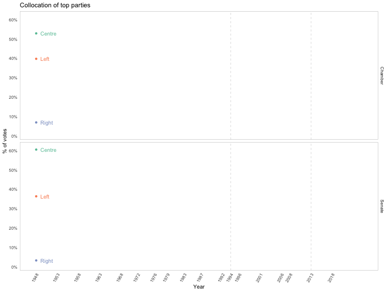

```{r}
library(tidyverse)
library(ggplot2)
library(ggridges)
library(dplyr)
library(rnaturalearth)
library(rgeos)
library(leaflet)
library(shiny)
library(sf)
library(viridis) 
library(shinydashboard)
library(ggrepel)
library(gganimate)
library(gifski)
library(plotly)
library(tidyr)
library(knitr)
library(ggparliament)
library(gifski)
library(magick)

`%notin%` <- Negate(`%in%`)

election_years <- c(1948, 1953, 1958, 1963, 1968, 1972, 1976, 1979, 1983, 1987, 1992, 1994, 1996, 2001, 2006, 2008, 2013, 2018)
```
## Purpose of this project

The main goal of this project is to provide a range of visual information regarding the Italian elections for both Chamber and Senate.
During the course of this work we will work with multiple election related features both at the national and regional level.
Additionally, we would like to find out if the employment rates in Italy are a relevant factor in influencing the political direction of the country.

## Notes on translations

For the purpose of this analysis, it has been decided to provide a translation for all Italian terms that we will encounter.
Since many of this terms have a non-univocal translation in English, it has been decided to provide a translation table that goes as follows:

ITALIAN TERM                TRANSLATION
Scrutinio                   Ballot
Lista (elettorale)          (Electoral) list
Elettore                    Constituent
Votante                     Voter
Scheda bianca               Empty vote
Scheda non valida           Null vote
Camera (dei Deputati)       Chamber (of Deputies)   
Senato (della Repubblica)   Senate (of the Republic)
Trasversalismo              Syncretic (politics)

In the following sections, during the length of the whole project, only the English terms will be used. 
The necessary steps will be taken in order to translate the Italian terms present in the used datasets to their English counterpart.

## Additional notes

In the context of the used datasets, the ballot contains information, for each election year and for both houses (Chamber and Senate), regarding the number of people that CAN vote (constituents) and the number of people that HAVE voted (voters).

The (electoral) list provides the number of votes received by each party during a given election year.

Italy introduced the universal suffrage in 1945 by extending the right to vote to women. 
Since the earliest election year in our dataset is 1948, all votes come from both male and female population.

All Italian citizen above the age of 18 can vote for the Chamber of Deputies.
Only those who have reached the age of 25 are able to vote for the election of the Senate.

## Information on data sources

Source: Italian Government (https://elezionistorico.interno.gov.it/)
Data: Lists and ballots for national and regional data
Path: ./source/elections/regions, ./source/elections/italy
File(s): lists-Senate-Reg.csv, ballots-Senate-Reg.csv, lists-Chamber-Reg.csv, ballots-Chamber-Reg.csv, ballots-Chamber.csv, lists-Chamber.csv, ballots-Senate.csv, lists-Senate.csv

Source: Italian Senate (http://www.senato.it/)
Data: Seats in the Italian Senate
Path: ./source/elections
File(s): senate-seats.csv

Source: Wikipedia (https://en.wikipedia.org)
Data: Parties collocation
Path: ./source/elections
File(s): party-collocation.csv

Source: ISTAT (https://www4.istat.it/en/)
Data: Employment rates
Path: ./source/labour
File(s): gdp-per-capita.csv

## Importing and cleaning political data

We will start off our project by cleaning the data related to the italian elections.
In order to reduce the number of .csv files associated with the project, some operation have been performed on the data sets outside of RStudio. 
The .csv files on the Government website are separated by House (Chamber/Senate), by type (ballot/list) and by election year. 
In order to reduce the total number of election related files in the project, a new "Year" column has been added to the original datasets. 
After that, the division by election year has been removed by merging the separate files.
The "candidate" column was also removed when present (since it was only there in an handful of election years).

```{r}
# National data (no region granularity)
ballot_senate_it <- read.csv(
  "./source/elections/italy/ballots-Senate.csv", 
  header = TRUE, 
  sep = ";"
)
ballot_chamber_it <- read.csv(
  "./source/elections/italy/ballots-Chamber.csv", 
  header = TRUE, 
  sep = ";"
)
list_senate_it <- read.csv(
  "./source/elections/italy/lists-Senate.csv",
  header = TRUE, 
  sep = ";"
)
list_chamber_it <- read.csv(
  "./source/elections/italy/lists-Chamber.csv", 
  header = TRUE, 
  sep = ";"
)

# Data with region granularity (No votes coming from outside of Italy)
ballot_senate_reg <- read.csv(
  "./source/elections/regions/ballots-Senate-Reg.csv", 
  header = TRUE, 
  sep = ";"
)
ballot_chamber_reg <- read.csv(
  "./source/elections/regions/ballots-Chamber-Reg.csv",
  header = TRUE, 
  sep = ";"
)
list_senate_reg <- read.csv(
  "./source/elections/regions/lists-Senate-Reg.csv", 
  header = TRUE, 
  sep = ";"
)
list_chamber_reg <- read.csv(
  "./source/elections/regions/lists-Chamber-Reg.csv", 
  header = TRUE, 
  sep = ";"
)

# Adding id column
ballot_senate_it <- ballot_senate_it %>% add_column(House = "Senate")
ballot_chamber_it <- ballot_chamber_it %>% add_column(House = "Chamber")
list_senate_it <- list_senate_it %>% add_column(House = "Senate")
list_chamber_it <- list_chamber_it %>% add_column(House = "Chamber")

ballot_senate_reg <- ballot_senate_reg %>% add_column(House = "Senate")
ballot_chamber_reg <- ballot_chamber_reg %>% add_column(House = "Chamber")
list_senate_reg <- list_senate_reg %>% add_column(House = "Senate")
list_chamber_reg <- list_chamber_reg %>% add_column(House = "Chamber")

# Joining 
ballot_it <- full_join(
  ballot_senate_it,
  ballot_chamber_it
)

list_it <- full_join(
  list_senate_it,
  list_chamber_it
)

ballot_reg <- full_join(
  ballot_senate_reg,
  ballot_chamber_reg
)

list_reg <- full_join(
  list_senate_reg,
  list_chamber_reg
)

# Translating column names
colnames(ballot_it) <- c("Region", "Constituents", "Voters", "Empty.votes", "Null.votes", "Year", "House")
colnames(list_it) <- c("Region", "Party", "Votes", "Year", "House")
colnames(ballot_reg) <- c("Region", "Constituents", "Voters", "Empty.votes", "Null.votes", "Year", "House")
colnames(list_reg) <- c("Region", "Party", "Votes", "Year", "House")

# We can group all lines that have the same year, house (and party for lists)
# We don't care if votes come from within our outside the country (Region column)
# We can also drop columns indicating empty or invalid votes
# A new column indicating the voter turnout is also added
# Voter turnout = (Voters / Constituents) * 100
ballot_it <- ballot_it %>%
  subset(select = -c(Region, Empty.votes, Null.votes)) %>%
  group_by(Year, House) %>%
  summarise_all(sum) %>%
  mutate(Voter.turnout = as.numeric(format(round((Voters / Constituents) * 100, 1), nsmall = 1)))

list_it <- list_it %>%
  subset(select = -Region) %>%
  group_by(Year, House, Party) %>%
  summarise_all(sum)

# We want to obtain uniform region names for both regional lists and ballots
# Trim trailing whitespaces
ballot_reg$Region <- trimws(
    ballot_reg$Region, 
    which = "r"
  ) 

# For certain years, region are divided into "zones" (e.g. CAMPANIA 1, CAMPANIA 2, ...). 
# We should remove the trailing integers (and later group them)
ballot_reg$Region <- sub(
    "\\s\\d+$", 
    "", 
    ballot_reg$Region
  )

# We can now group by region, year and house. 
# We can also change region names for the years in which they are not consistent with the rest of the dataset
# For years 48/68 - Drop column with 'ABRUZZI E MOLISE' since the individual regions have their own data
# For the other years with 'ABRUZZI E MOLISE', separate the rows and use for both regions
ballot_reg <- ballot_reg[!(ballot_reg$Region=='ABRUZZI E MOLISE' & (ballot_reg$Year==1948 | ballot_reg$Year==1968)),] %>%
  separate_rows(Region, sep = ' E ') %>%
  subset(select = -c(Empty.votes, Null.votes)) %>%
  group_by(Region, Year, House) %>%
  summarise_all(sum) %>%
  mutate(Voter.turnout = as.numeric(format(round((Voters / Constituents) * 100, 1), nsmall = 1))) %>%
  mutate(
    Region = str_to_upper(Region), Region = case_when(
      Region == "ABRUZZI" ~ "ABRUZZO",
      Region == "TRENTINO-ALTO ADIGE/SUDTIROL" ~ "TRENTINO ALTO ADIGE",
      Region == "TRENTINO-ALTO ADIGE" ~ "TRENTINO ALTO ADIGE",
      Region == "FRIULI VENEZIA GIULIA" ~ "FRIULI-VENEZIA GIULIA",
      Region == "EMILIA-ROMAGNA" ~ "EMILIA ROMAGNA",
      Region == "VALLE D'AOSTA -" ~ "VALLE D'AOSTA",
      Region == "VALLE D'AOSTA-" ~ "VALLE D'AOSTA",
      TRUE ~ Region
    )
  )

# Repeating a similar process for lists
list_reg$Region <- trimws(
    list_reg$Region, 
    which = "r"
  ) 
list_reg$Region <- sub(
    "\\s\\d+$", 
    "", 
    list_reg$Region
  )

list_reg <- list_reg[!(list_reg$Region=='ABRUZZI E MOLISE' & (list_reg$Year==1948 | list_reg$Year==1968)),]  %>%
  separate_rows(Region, sep = ' E ') %>%
  group_by(Region, Year, House, Party) %>%
  summarise_all(sum) %>%
  mutate(
    Region = str_to_upper(Region), Region = case_when(
      Region == "ABRUZZI" ~ "ABRUZZO",
      Region == "TRENTINO-ALTO ADIGE/SUDTIROL" ~ "TRENTINO ALTO ADIGE",
      Region == "TRENTINO-ALTO ADIGE" ~ "TRENTINO ALTO ADIGE",
      Region == "FRIULI VENEZIA GIULIA" ~ "FRIULI-VENEZIA GIULIA",
      Region == "EMILIA-ROMAGNA" ~ "EMILIA ROMAGNA",
      Region == "VALLE D'AOSTA -" ~ "VALLE D'AOSTA",
      Region == "VALLE D'AOSTA-" ~ "VALLE D'AOSTA",
      TRUE ~ Region
    )
  )

  
#list_reg$Region[list_reg$Region=='ABRUZZI E MOLISE'] <- 'ABRUZZO'
#ballot_reg$Region[ballot_reg$Region=='ABRUZZI E MOLISE'] <- 'ABRUZZO'

list_reg
list_it

ballot_reg
ballot_it
```

With this initial cleaning process we have organized our data into four different tables.
At this point, as a somewhat secondary step, we would also like to obtain (for both national and regional lists) two data tables in which we will keep only a set percentile of top voted parties for each year. 
This will later be useful to create more informative visualizations.

```{r}
list_it_top <- list_it %>% 
  group_by(Year, House) %>% 
  filter(quantile(Votes, 0.7)<Votes)
  
list_reg_top <- list_reg %>% 
  group_by(Region, Year, House) %>% 
  filter(quantile(Votes, 0.7)<Votes)
```

## Importing and adding collocation data

We will now take this newly created data tables and append to them a new column with the purpose of describing the political collocation of the contained parties.
This additional data will be taken by a new csv file especially created for this purpose.
A political party always falls into one of the following collocations:
Far-Left,Left,Centre-Left,Centre,Centre-Right,Syncretic,Right,Far-Right

```{r}
party_collocation <- read.csv(
  "./source/elections/party-collocation.csv", 
  header = TRUE, 
  sep = ";"
)

list_it_top <- left_join(
  list_it_top,
  party_collocation
)

list_reg_top <- left_join(
  list_reg_top,
  party_collocation
)

list_it_top
list_reg_top
```

## Importing and cleaning employment data

We are now ready to import (and start cleaning) the second dataset that we will use in this project.
First year with employment rate data (total + zone): 1973
First year with regional granularity: 1993
We will start by importing the csv file containing the employment rate data.

```{r}
empl_rate_raw <- read.csv(
  "./source/labour/employment-rate.csv", 
  header = TRUE, 
  sep = ","
)

empl_rate_raw
```

In the raw dataset we have many columns that have id codes that are spelled out in their complete form in other columns.
The interested columns are highlited in the following table:

ID COLUMN       FULL NAME COLUMN
ITTER107        Territorio
TIPO_DATO_FOL   Tipo.dato
SEXISTAT1       Sesso
ETA1            Classe.di.eta
TITOLO_STUDIO   Titolo.di.studio
TIME            Seleziona.periodo 

We can drop all columns containing ids.
Using the unique() function we can also notice that the columns "Tipo.data", "Flag.Codes" and "Flags" do not provide any useful data.

```{r}
unique(empl_rate_raw$Tipo.data)
unique(empl_rate_raw$Flag.Codes)
unique(empl_rate_raw$Flags)
```

Because of this reason, we can drop this columns too.

```{r}
# Drop columns
empl_rate <- empl_rate_raw %>%
  subset(select = -c(ITTER107, TIPO_DATO_FOL, SEXISTAT1, ETA1, TITOLO_STUDIO, TIME, Tipo.dato, Flag.Codes, Flags))

# Translate column names
colnames(empl_rate) <- c("Region", "Sex", "Age", "Education.level", "Year", "Value")

empl_rate
```

At this point, the dataset still contains an higher level of granularity than needed. 
Since we are not looking for a division based on the level of education, we want to keep only the rows where the education level has value total (totale), we can then drop the "Education.level" column.
We can do the same thing for the age column. In this case we will keep the rows that have age range 15-64, which is the widest possible range for people in their working years.
We could keep the 15+ range instead, but this would significantly lower the mean employment values since it also considers the senile population.
We can also filter out male/females rows on the sex column in order to keep only the totals values.
The year columns also contains quarterly values for each year. We can drop the quarterly rows and keep only the aggregate data for each year.
We also need to drop some values from the Region column. In this regard we want to keep only the national values and the regional values (hence dropping the ones related to macro-regions).

```{r}
macro_regions <- c("Nord", "Nord-ovest", "Nord-est", "Centro", "Mezzogiorno")

#All quarterly values for the year column contain letters. We filter them out by trying to convert to integer and then checking if the resul is Na
empl_rate <- empl_rate %>%
  filter(
      Education.level == "totale" &
      Sex == "totale" &
      Age == "15-64 anni" &
      !is.na(as.numeric(Year)) &
      Region %notin% macro_regions
  ) %>%
  subset(select = -c(Education.level, Sex, Age))
```


Now, we can split this large table into a national and a regional one.

```{r}
empl_rate_it <- empl_rate %>%
  filter(Region == 'Italia') %>%
  subset(select = -Region) %>%
  mutate(Year = as.integer(Year)) %>%
  rename(Empl.Rate = Value)

empl_rate_reg <- empl_rate %>%
  filter(Region != 'Italia') %>%
  mutate(Year = as.integer(Year)) %>%
  rename(Empl.Rate = Value)

empl_rate_it
empl_rate_reg
```

## Visualizing election data

With our processed data, we are now ready to move to the visualization part of this project. 
We will start this chapter by trying to create a map of Italy displaying multiple information regarding our election data.
In order to do this, we will get the geom. data needed to plot Italy on a map by using the ne_state() function of the naturalearth library.
After that, we will need to group the resulting rows based on region (since that is the smallest level of granularity we are interested in).
Final, we will calculate the centroid latitude and longitude for each region. This will be later useful to conditionally plot bubbles that are correctly centered to the corresponding regions.

```{r}
# Centroid latitude and longitude in order to find the circle marker center for leaflet
italy <- ne_states(country="Italy", returnclass="sf") %>%
  rename(Region = region) %>%
  group_by(Region) %>% 
  summarise() %>%
  mutate(
    Region = str_to_upper(Region),
    Region = case_when(
      Region == 'APULIA' ~ 'PUGLIA',
      Region == 'SICILY' ~ 'SICILIA',
      Region == 'TRENTINO-ALTO ADIGE' ~ 'TRENTINO ALTO ADIGE',
      Region == 'EMILIA-ROMAGNA' ~ 'EMILIA ROMAGNA',
      TRUE ~ Region
    ),
    centroid_lat = st_coordinates(st_centroid(geometry))[,1],
    centroid_long = st_coordinates(st_centroid(geometry))[,2]
  )

italy
```

In order to have all we need in a single table, we will the geom data that we just gathered with the electoral data that we cleaned at the beginning of this project.
Starting from the two tables containing lists, we will try to group multiple rows belonging to the same year and House. The party and votes columns will be merged together (the final format will be "Party: Votes") and the values belonging to multiple rows will be separated by a HTML <br> tag.
This grouping will make it easier for us to display these information directly on a map without doing this processing in real time.

```{r}
# Building aggregate lists
aggregate_list_it <- list_it_top %>%
  group_by(Year, House) %>%
  arrange(-Votes) %>% 
  mutate(
    Party = paste(Party, formatC(Votes, format="f", big.mark = ",", digits=0), sep = ':', collapse = '<br/>'),
    Collocation = first(Collocation)
    ) %>%
  subset(select = -c(Votes)) %>%
  distinct(Year, House, Party, Collocation)

aggregate_list_reg <- list_reg_top %>%
  group_by(Year, Region, House) %>%
  arrange(-Votes) %>%
  mutate(
    Party = paste(Party, formatC(Votes, format="f", big.mark = ",", digits=0), sep = ':', collapse = '<br/>'),
    Collocation = first(Collocation)
    ) %>%
  subset(select = -c(Votes)) %>%
  distinct(Region, Year, House, Party, Collocation)

aggregate_list_it
aggregate_list_reg
```

We can now join the table containing the geom data with the grouped lists we have just created.

```{r}
# Contains geom data + regional data for both lists and ballots
italy <- italy %>%
  inner_join(ballot_reg, by='Region') %>%
  inner_join(aggregate_list_reg, by=c('Region', 'Year', 'House'))

italy
```

At this point, our main table is finally ready to be used in our visualization.
We will use the Leaflet library to create an interactive map of Italy.
For starters, we are going to visually represent Chamber's results coming from the last election year.
The region fill color (Green to Yellow to Red) will correspond to the voter turnout value.
We will later explore how to make our map even more interactive by adding to ability to visualize a larger timespan.

```{r}
# Filtering
italy_filtered <- italy %>% 
  filter(Year == max(italy$Year), House == 'Chamber')

ballot_it_filtered <- ballot_it %>%
filter(Year == max(italy$Year), House == 'Chamber')

# Label for bottom-right persistent legend (National level)
it_labels <- paste(
  'Voter turnout: ', 
  ballot_it_filtered$Voter.turnout, 
  '<br/>',
  'Parties: ', 
  aggregate_list_it$Party
) %>%
  lapply(htmltools::HTML)

# Label for individual regions
reg_labels <- paste(
  '<strong>Region: ', italy_filtered$Region, '</strong><br/>',
  'Voter turnout: ', italy_filtered$Voter.turnout, '%<br/>',
  'Parties:<br/>', italy_filtered$Party
) %>%
  lapply(htmltools::HTML)

pal <- colorNumeric(palette = 'RdYlGn',domain = italy_filtered$Voter.turnout)

leaflet(italy_filtered) %>%
addPolygons(
  stroke = TRUE,
  color = 'Grey',
  weight = 1.5,
  label = reg_labels,
  fillColor = ~pal(italy_filtered$Voter.turnout),
  highlightOptions = highlightOptions(color = "grey", weight = 3, bringToFront = TRUE)
) %>%
addLegend(pal = pal,
          values = italy_filtered$Voter.turnout,
          opacity = 0.7,
          title = 'Voter Turnout',
          position = 'bottomright',
          labFormat = labelFormat(suffix = "%"))

```

This initial visualization already gives us an interesting look at the chosen election year.
We would now like to try to use our collocation data to fill our regions rather than the voter turnout.

```{r}
palColl <- colorFactor('Set2', domain=c('Far-Left','Left','Centre-Left','Centre','Syncretic','Centre-Right','Right','Far-Right'))

collLabels <- unique(italy$Collocation)

italy_filtered

leaflet(italy_filtered) %>%
addPolygons(
  stroke = TRUE,
  color = 'Grey',
  weight = 1.5,
  label = reg_labels,
  fillColor = ~palColl(italy_filtered$Collocation),
  highlightOptions = highlightOptions(color = "grey", weight = 3, bringToFront = TRUE)
) %>%
addLegend(pal = palColl,
          values = collLabels,
          opacity = 0.7,
          title = 'Top party collocation',
          position = 'bottomright')
```

We can now try to utilize the centroid information that we've calculate before to plot bubbles instead of region shape.
The bubble size will be directly related to the total nr of voters for each region.

```{r}
leaflet(italy_filtered) %>%
addCircleMarkers(
  stroke = TRUE,
  color = 'Grey',
  weight = 1.5,
  label = reg_labels,
  italy_filtered$centroid_lat,
  italy_filtered$centroid_long,
  radius = sqrt(italy_filtered$Voters/10000),
  fillColor = ~pal(italy_filtered$Voter.turnout)
) %>%
addLegend(pal = pal,
          values = italy_filtered$Voter.turnout,
          opacity = 0.7,
          title = 'Voter Turnout',
          position = 'bottomright',
          labFormat = labelFormat(suffix = "%"))
```

In order to be able to dinammically change our map based on Year, House, Shape and Fill Color,  we can proceed to merge everything we have written thus far into a single shiny app.
In this final visualization we will also add a persistent text box that will display information for the national level.

```{r}
ui <- fluidPage(
  titlePanel(title=h4("Electoral data", align="center")),
  sidebarLayout(
    sidebarPanel(
      selectInput(
        inputId =  'year_sel', 
        label = "Select year:", 
        choices = election_years
      ),
      selectInput(
        inputId =  'house_sel', 
        label = "Select house:", 
        choices = c('Chamber', 'Senate')
      ),
      selectInput(
        inputId =  'shape_sel', 
        label = 'Select shape:', 
        choices = c('Regions', 'Voters', 'Both')
      ),
      selectInput(
        inputId = 'fill_sel',
        label = 'Select fill color:',
        choices = c('Voter turnout', 'Top party collocation')
      )
    ),
    mainPanel(
      leafletOutput('map'),
      fluidRow(infoBoxOutput('nat_info'))
    ),
  )
)

server <- function(input, output) {
  # Filtering
  italy_React <- reactive({
    italy %>% filter(Year == input$year_sel, House == input$house_sel)
  })
  
  ballot_React <- reactive({
    ballot_it %>% filter(Year == input$year_sel, House == input$house_sel)
  })
  
  aggregate_list_React <- reactive({
    aggregate_list_it %>% filter(Year == input$year_sel, House == input$house_sel)
  })
  
  pal <- reactive({
    if(input$fill_sel == 'Voter turnout') {
      colorNumeric(
        palette = 'RdYlGn',
        domain = c(min(italy$Voter.turnout), max(italy$Voter.turnout)
      )
    )
    }
    else {
      colorFactor(
        'Set2', 
        domain=c('Far-Left','Left','Centre-Left','Centre','Syncretic','Centre-Right','Right','Far-Right')
      )
    }
  })
  
  fillCol <- reactive({
    #Fill column
    if(input$fill_sel == 'Voter turnout') {
      italy_React()$Voter.turnout
    }
    else {
      italy_React()$Collocation
    }
  })
    
  # Label for individual regions
  reg_labels <- reactive({
    reg_labels <- paste(
      '<strong>Region: ', italy_React()$Region, '</strong><br/>',
      'Voter turnout: ', italy_React()$Voter.turnout, '%<br/>',
      'Parties:<br/>', italy_React()$Party
    ) %>%
      lapply(htmltools::HTML)
  })
  
  output$nat_info <- renderInfoBox({
    infoBox(
      paste(
        'Voter turnout: ', ballot_React()$Voter.turnout, '%<br/>',
        'Parties:<br/>', aggregate_list_React()$Party
      ) %>%
        lapply(htmltools::HTML)
    )
  })
  
  map_data <- reactive({
    if((input$shape_sel == 'Regions')) {
      m <- leaflet(italy_React()) %>%
      addPolygons(
          stroke = TRUE,
          color = 'Grey',
          weight = 1.5,
          label = reg_labels(),
          highlightOptions = highlightOptions(color = "grey", weight = 3, bringToFront = TRUE),
          fillColor = ~pal()(fillCol()))
    }
    else if(input$shape_sel == 'Voters') {
      m <- leaflet(italy_React()) %>%
      addCircleMarkers(
            stroke = TRUE,
            color = 'Grey',
            weight = 1.5,
            label = reg_labels(),
            italy_React()$centroid_lat,
            italy_React()$centroid_long,
            radius = sqrt(italy_React()$Voters/10000),
            fillColor = ~pal()(fillCol()))
    }
    else{
      m <- leaflet(italy_React()) %>%
      addPolygons(
          stroke = TRUE,
          color = 'Grey',
          weight = 1.5) %>%
      addCircleMarkers(
            stroke = TRUE,
            color = 'Grey',
            weight = 1.5,
            label = reg_labels(),
            italy_React()$centroid_lat,
            italy_React()$centroid_long,
            radius = sqrt(italy_React()$Voters/10000),
            fillColor = ~pal()(fillCol()))
    }
  })

  output$map <- renderLeaflet({
    if(input$fill_sel == 'Voter turnout') {
      map_data() %>%
      addLegend(
          pal = pal(),  
          values = fillCol(),
          opacity = 0.7,
          position = 'bottomright',
          title = 'Voter Turnout',
          labFormat = labelFormat(suffix = "%"),
        )
    }
    else {
      map_data() %>%
      addLegend(
          pal = pal(),  
          values = fillCol(),
          opacity = 0.7,
          position = 'bottomright',
          title = 'Collocation',
        )
    }
  })
}

shinyApp(ui, server)
```
Now that we have provided a fairly complete and interactive look at our data, we will proceed to display more specific information that was maybe not immediately noticeable from our previous efforts.
A very simple initial visualization for this type of information would be a general overview of the voter turnout, for both houses, throughout all the election years.

```{r}
ggplot(ballot_it, aes(x=Year, y=Voter.turnout, color=House)) + 
  ggtitle("Voter turnout") +
  geom_line() + 
  geom_point() +  
  expand_limits(y=c(50, 100)) +
  scale_y_continuous(labels=function(x) paste0(x, '%')) +
  scale_x_continuous(breaks=election_years) +
  scale_color_brewer(palette = "Set2") +
  ylab('Voter turnout') + 
  facet_grid(vars(House)) +
  theme_bw() +
  theme(axis.text.x = element_text(angle = 60, hjust = 1)) 
```

As we can see, the voter turnout has steadily dropped after 1976, going from more than 90% to less than 70% in the 2018 election.
Knowing this fact, it may also be interesting to visually explore how the proportions have changed between constituents and voters and how much these two groups have grown (together with the Italian population) during the last 70 years (which is an information that we are not able to gather from this first line chart).
In order to do this, we are going to plot a bar chart, for both Houses, with the Voters bar overlayed on top of the Constituents one (since the Voters pool will always be smaller than the Constituents one).

```{r}
ggplot(ballot_it) +
  ggtitle("Voters/Constituents proportion") +
  geom_hline(yintercept=mean(ballot_it$Voters), linetype='dotted')+
  geom_col(aes(x=Year, y=Constituents, fill='Constituents'), colour='black') +
  geom_col(aes(x=Year, y=Voters, fill='Voters'), colour='black') +
  scale_x_continuous(breaks=election_years) +
  scale_y_continuous(labels = scales::unit_format(unit = "M", scale = 1e-6)) +
  scale_fill_brewer(palette = "Set2", direction=-1) +
  facet_grid(vars(House)) +
  theme_bw() +
  theme(
    axis.text.x = element_text(angle = 60, hjust = 1),
    legend.title = element_blank())
```  
As we can see, despite a much bigger pool of Constituents (caused, more than likely, by an increase in the overall population), the disparity between voters and constituents has constantly increased starting from the 70s.

After these initial views on some basic data related to the election years for both Houses, we can start to take a closer look at the parties that were part of said elections.
We will start by plotting the total nr. of parties that were present for each election year (at the national level).
We can also display a linear regression line to better understand how this specific trend is moving.

```{r}
list_it_grouped <- list_it %>%
  group_by(Year, House) %>%
  summarise(Party = n_distinct(Party))

ggplot(list_it_grouped, aes(x=Year, y=Party, fill=House)) +
  ggtitle("Total nr. of parties per election year") +
  geom_smooth(method='lm', color='black', se=FALSE, linetype='twodash', size=0.75, show.legend=FALSE, alpha=0.4) +
  geom_col(colour='black') +
  scale_y_continuous(labels=function(x) paste0(x, '%')) +
  scale_x_continuous(breaks=election_years) +
  scale_fill_brewer(palette = "Set2") +
  ylab('Nr. of parties') +
  facet_grid(vars(House)) +
  theme_bw() +
  theme(axis.text.x = element_text(angle = 60, hjust = 1))
```
This bar chart allows us to see how the total number of parties per election years is generally increasing compared to the first election years. We can also see how election years like 1994 (for Cahmber) and 2006/2008 have a noticeably higher nr of total parties participating to the election.

A this point, a good idea would be to display the changes in the political specturm for all regions across all election years.
A good way to display this information is to use a heatmap.

```{r}
ggplot(aggregate_list_reg, aes(x=Year,y=Region,fill=Collocation)) +
  ggtitle("Political collocation of top voted parties") +
  geom_tile(colour='black') +
  scale_x_continuous(breaks=election_years) +
  scale_fill_brewer(palette = "Set2") +
  facet_grid(vars(House)) +
  theme_test() +
  theme(axis.text.x = element_text(angle = 60, hjust = 1)) 
```
This heatmap allows us to see the radical shifts that took place in Italy starting from the middle of the 90s. We will later try to briefly justify this shifts using the employment data that we have previously imported.

Another interesting thing we can do with our data is calculating the percentage of parties belonging to/sharing a given political collocation (this will be an estimation over the total since we only have Collocation information for top voted parties).
In order to do this, we will group together (for each Year and House) all the rows with parties belonging to the same political collocation and we will add a new Percent column that will indicate the percentage of votes that the given collocation has received in the specific election year.
This additional data will allow us to further explore the change in political view of the Italian population that was introduced in the previous plot. 

```{r}
#x=year, y=% of votes among the top parties, fill=collocation
list_coll_percent <- list_reg_top %>%
  group_by(Year,House,Collocation) %>%
  summarise(Votes = sum(Votes)) %>%
  mutate(Percent = (Votes/sum(Votes)) * 100)  %>%
  arrange(Year, House, Collocation)

list_coll_percent
```

Firstly, we will create an animated lineplot to visually show how these percentages have moved throughout the years.
In order to avoid an excessive clutter that would make this animation unreadable, we are going to group together all collocations belonging to the same spectrum (e.g. Far-Left, Left and Centre-Left will be grouped together into Left).
Syncretic rows kept only for 2013 and 2018 to account for the rise of M5S.


```{r}
list_coll_grouped <- list_coll_percent  %>%
  filter(!(grepl('Syncretic', Collocation) & (Year < 2013))) %>%
  mutate(Collocation = 
           ifelse(
             grepl('Left', Collocation), 
             'Left',
             ifelse(
               grepl('Right', Collocation), 
               'Right', 
               Collocation
             )
           )
  ) %>%
  group_by(Year,House,Collocation) %>%
  summarise_all(sum)

coll_years_anim <- ggplot(
  list_coll_grouped, 
  aes(x=Year, y=Percent, color=Collocation)) + 
  ggtitle("Collocation of top parties") +
  geom_line() + 
  geom_point() +
  geom_vline(xintercept=1994, color='Grey', linetype=2, alpha=0.5) +
  geom_vline(xintercept=2013, color='Grey', linetype=2, alpha=0.5) +
  geom_text(aes(x = Year + 1, label = Collocation), hjust = 0) + 
  scale_y_continuous(labels=function(x) paste0(x, '%'), breaks=seq(0, 60, 10)) +
  scale_x_continuous(breaks=election_years, limits = c(min(election_years), max(election_years)+7)) +
  scale_color_brewer(palette = "Set2") +
  ylab('% of votes') + 
  facet_grid(vars(House)) +
  theme_minimal() +
  theme(
    axis.text.x = element_text(angle = 60, hjust = 1),
    legend.position = "none",
    panel.grid.major = element_blank(), 
    panel.grid.minor = element_blank(),
    panel.border = element_rect(colour = "grey", fill = NA)
    ) +
  transition_reveal(Year) +
  ease_aes("linear") +
  enter_fade() +  
  exit_fade()

animate(coll_years_anim, fps = 25, duration = 20, width = 800, height = 600, end_pause = 100, renderer=gifski_renderer('./gifs/collocation_over_years.gif'))
```

```{r}

```

This animation reinforces what we discovered in the previous heatmap by clearly showing the two major shifts (here indicated by vertical dotted lines) that happend in the last 25 years.
To compensate for the lack of granularity of this previous plot, we will now provide a more complete view on the same topic. 
In order to achieve this, we will plot an interactive bar chart that will show all political collocations. We will use the plotly library to achieve this.
To avoid unwanted behaviors in the interactive plot, let's first make sure that every year (and House) possess rows for all political collocations. 

```{r}
list_coll_filled <- list_coll_percent %>%
  group_by(Year, House) %>%
  complete(
    Collocation = c('Far-Left','Left','Centre-Left','Centre','Syncretic','Centre-Right','Right','Far-Right'),
    fill = list(Votes = 0, Percent = 0)
  )

list_coll_filled
```
We are now ready to create our visualization.

```{r}
plot_coll_bar <- function(curr_house) {
  list_coll_filled %>%
  filter(!grepl(curr_house, House)) %>%
    plot_ly(
      data = .,
      x = ~Collocation, 
      y = ~Percent/100, 
      color = ~Collocation, 
      frame = ~Year, 
      text = ~Percent,
      hoverinfo = "text",
      type = 'bar',
      mode = 'markers'
    ) %>%
    layout(
      title = 'Collocation of top parties',
      xaxis = list(title = FALSE),
      yaxis = list(title = FALSE, tickformat = '%')
    ) %>%
    animation_opts(
      easing = "elastic", redraw = FALSE
    )
}

coll_senate <- plot_coll_bar('Senate')
coll_chamber <- plot_coll_bar('Chamber')

subplot(coll_chamber, coll_senate, nrows = 1, shareX = TRUE, shareY = TRUE) %>% 
  layout(annotations = list(
    list(x = 0.2 , y = 1.02, text = "Senate", showarrow = FALSE, xref='paper', yref='paper'),
    list(x = 0.8 , y = 1.02, text = "Chamber", showarrow = FALSE, xref='paper', yref='paper'))
    ) %>% 
  config(displayModeBar = FALSE)
```

## Comparing employment rates with the shift in political views

The previous plots clearly indicate the election of 1994 as a tipping point for the Italian politics. What was previously a country governed mostly by center (particularly Democrazia Cristiana) and Left wing parties quickly saw Right wing and Syncretic parties taking over the political landscape.
We will now try to identify if changes in the employment rates may have, at least in part, triggered this sudden change.

```{r}
list_coll_filled %>%
    filter((House == 'Chamber') & (Percent > 0) & (Year >= 1979)) %>%
    mutate(Rank = rank(Percent))
```

```{r}
coll_circle_anim <- list_coll_filled %>%
    filter((House == 'Chamber') & (Percent > 0) & (Year >= 1979)) %>%
    mutate(Rank = rank(Percent)) %>%
    ggplot(aes(x=Rank, y=Percent*100, fill=Collocation)) +
      geom_bar(stat='identity') +
      geom_text(
        hjust = 1, 
        size = 3, 
        aes( y = 0, label = paste(
          Collocation,' - ', round(Percent, digits=1), '%  ')
        )
      ) +
      theme_minimal() +
      scale_fill_brewer(palette = "Set2") +
      theme(
        panel.grid = element_blank(),
        panel.border = element_blank(),
        legend.position='none',
        axis.text = element_blank(),
        axis.ticks = element_blank(),
        axis.title = element_blank()
      ) +
      coord_polar(theta = 'y') +
      ylim(0,10000) +
      transition_states(
        Year,
        transition_length = 0,
        state_length = 2
      )

animate(coll_circle_anim, fps = 25, duration = 50, width = 800, height = 600, end_pause = 100, renderer=gifski_renderer('./gifs/collocation_circle_over_years.gif'))
```

```{r}
employment_rate_line <- ggplot(empl_rate_it, aes(x=Year, y=Empl.Rate)) +
  geom_line()  +
  transition_reveal(Year) +
  ease_aes("linear") +
  enter_fade() +  
  exit_fade() +
  geom_point(
    data=empl_rate_it[empl_rate_it$Year==1995 | empl_rate_it$Year==2013,], 
    aes(color='Red', group=interaction(Year))
  ) +
  geom_text(
    data=empl_rate_it[empl_rate_it$Year==1995 | empl_rate_it$Year==2013,], 
    aes(color='Red', label='Local min.', group=interaction(Year)),
    hjust=-0.1, vjust=1.1, size=3
  ) +
  scale_x_discrete(limits=election_years[election_years>1976]) +
  scale_y_continuous(labels=function(x) paste0(x, '%'), breaks=seq(53, 59, 1)) +
  ylab('Employment rate') +
  xlab('(Election) Year') +
  geom_vline(xintercept=1994, color='Grey', linetype=2, alpha=0.5) +
  geom_vline(xintercept=2013, color='Grey', linetype=2, alpha=0.5) +
  ggtitle('Employment rate') +
  theme_bw() +
  theme(
    axis.text.x = element_text(angle = 60, hjust = 1),
    legend.position = "none",
    panel.grid.major = element_blank(), 
    panel.grid.minor = element_blank(),
    panel.border = element_rect(colour = "grey", fill = NA)
  )

animate(employment_rate_line, fps = 25, duration = 50, width = 800, height = 600, end_pause = 100, renderer=gifski_renderer('./gifs/employment_rate_line.gif'))
```

```{r}
circle <- image_read('./gifs/collocation_circle_over_years.gif') 
rate <- image_read('./gifs/employment_rate_line.gif')

new_gif<-image_append(c(rate[1], circle[1]))
for(i in 2:1250){
  combined <- image_append(c(rate[i], circle[i]))
  new_gif<-c(new_gif,combined)
}

new_gif
```

As we might have expected, this changes in political trends line up with two local minimum values for the employment rates that we can see in the years 1995 and 2013.
The vertical dotted lines represent (just like in the previous animated line chart) the election years in which a political shift happened in Italy.
We can assume that this downturns in the labour market may have been the source for a general lack of trust from the Italian population in the current government. 

## Extra - Visualizing Senate seats

As a (somewhat) additional task, it may also be interesting to visually represent the seats for one of the two Houses.
In order to do this, we will start by importing a new dataset containing the number of Senate seats assigned to each political party during all mandates.

```{r}
senate_seats <- read.csv(
  "./source/elections/senate-seats.csv",
  header = TRUE, 
  sep = ";"
) %>%
  subset(select=-House)

senate_seats
```
We can now use Shiny to create an interactive view that will dynamically display the senate seats for all election years.
Additionally, we will use the ggparliament library to facilitate the creation of an accurate visualization of the Senate seats.

```{r}
ui <- fluidPage(
  sidebarLayout(
    sidebarPanel(
      selectInput(
        inputId =  'year_sel', 
        label = "Select year:", 
        choices = election_years
      )
    ),
    mainPanel(
      plotOutput('seats')
    )
  )
)

server <- function(input, output, session) {
  # Filtering
  senate_react <- reactive({
    #senate_seats %>% filter(Year == input$year_sel)
    senate_seats[senate_seats$Year==input$year_sel,]
  })
  
  semicricle_react <- reactive({
    senate_react() %>% 
      parliament_data(type = "semicircle",
                      parl_rows = 8,
                      party_seats = senate_react()$Seats)
  })

  output$seats <- renderPlot({
    semicricle_react() %>% ggplot(aes(x=x, y=y, colour=Party)) +
    ggtitle("Senate seats") +
    geom_parliament_seats() +
    theme_ggparliament() +
    scale_color_brewer(palette = "Set2") 
  })
}
shinyApp(ui, server)
```

## Conclusions

During the course of this project we had the chance to explore multiple aspects related to the Italian elections for both Chamber and Senate.
After collecting and cleaning our datasets we had the chance to provide an in-depth interactive map of Italy that provided a range of different information such us: Voter turnout, top voted parties, political collocation and total nr of voters.
We then created a set of more static views that allowed us to give more focused insights in the previously mentioned topic.
We also decided to add, at the end of this project, an additional chapter showing (once again) an interactive view of the Senate seats distribution throughout the various election years.

As a brief final summary, we can list the findings derived from this exploration as follows:
 - Despite an increasing pool of Italian constituents, the voter turnout has been steadily decreasing since the 70s (going from more than 90% to around 70% in the last election).
 - The first 40 years of Italian elections (after WWII) have seen a very stable political landscape, which has been governed mostly by centre and left facing parties.
 - The last 25 years have seen two major shifts in the political views of the country (first from centre/centre-left to centre-right, then from centre-right to syncretic/far-left).
 - These two shifts seem to match very closely with downturns in the employment rates in Italy.
 - The total pool of parties for each election is generally increasing.


